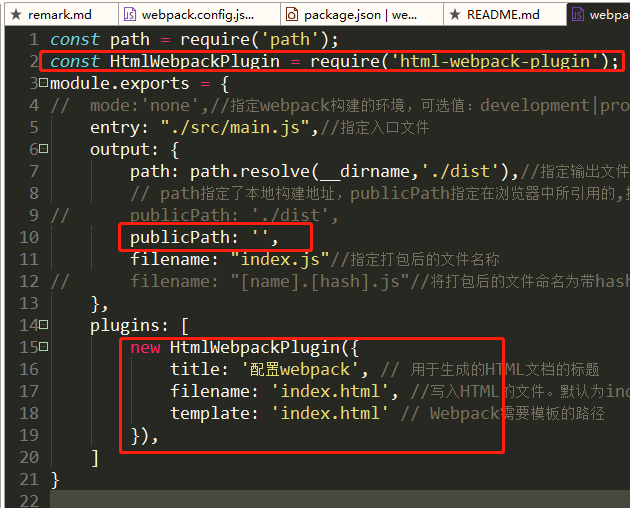

# 从零搭建webpack配置

## 1. 搭建项目，命令行终端进入到该项目并执行npm init 来初始化项目的package.json文件

## 2. 在目录中安装webpack相关依赖

> 
  1) cnpm install webpack --save-dev : 本项目的webpack依赖 
  2) cnpm install webpack-cli --save-dev : webpack4.0以后的版本都需要安转这个依赖 
  3) npm install webpack --save-dev : 安装热更新模块 

## 3. 在根目录下生成webpack.config.js文件，并且配置相关的入口出口文件

```
const path = require('path');
module.exports = {
//	mode:'none',//指定webpack构建的环境，可选值：development|production|none
	entry: "./src/main.js",//指定入口文件
    output: {
        path: path.resolve(__dirname,'./dist'),//指定输出文件
        // path指定了本地构建地址，publicPath指定在浏览器中所引用的,指定的是构建后在html里的路径,跟上面的path无关
        publicPath: './dist',
        filename: "index.js"//指定打包后的文件名称 
//      filename: "[name].[hash].js"//将打包后的文件命名为带hash的唯一文件，防止文件缓存
    }
}

注意！！！ publicPath配置的是什么目录，在index.html文件里面引入js文件的目录就以什么开头，如：
publicPath: '/dist/' ----- <script type="text/javascript" src="dist/index.js"></script>
publicPath: '/base/' ----- <script type="text/javascript" src="base/index.js"></script>

注意！！！ 文件的路径在同级的时候需要使用./,使用/的时候会报错
```
## 4. 在跟目录下创建src文件夹，并在文件夹里面创建main.js文件,随便写点js代码测试一下即可
## 5. 在根目录下创建index.html文件，在index.html文件里面引用webpack打包生成的js文件
```
<body>
	<h1>hello world</h1>
	
	<script type="text/javascript" src="dist/index.js"></script>
</body>
```
## 6. 配置package.json文件,在scripts里面加如下代码，可指定项目启动的端口号
```
"dev": "webpack-dev-server --port 9898 --open"
```

## 7. 如何让打包后的js文件自动引入到index.html文件

```
cnpm install html-webpack-plugin --save-dev
在main.js文件里面按如下图片配置
重新启动项目，打开浏览器就会发现打包后的index.js会自动引入到index.html文件里面
```



